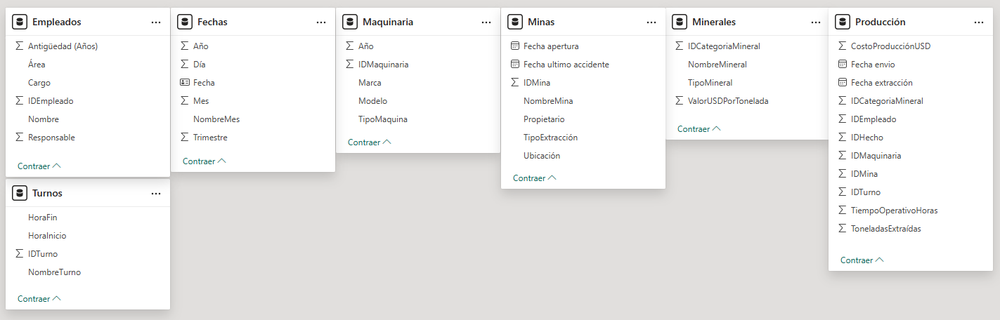
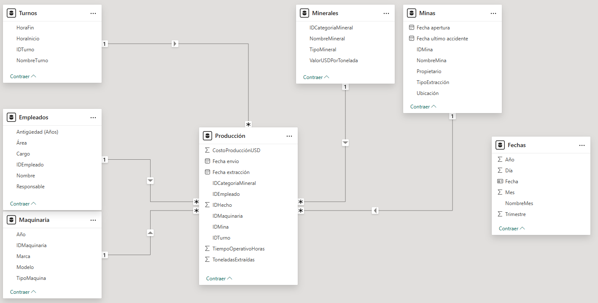
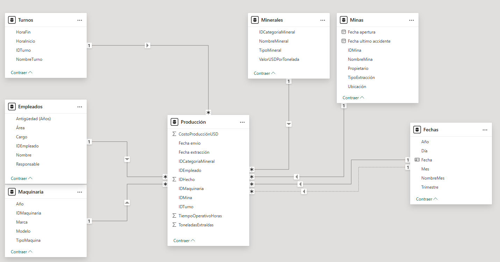
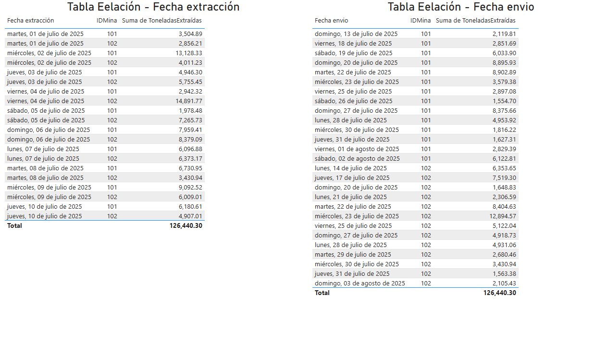
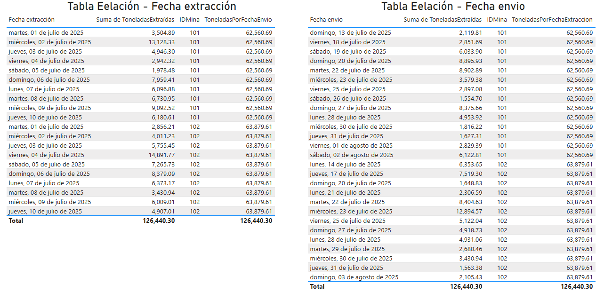
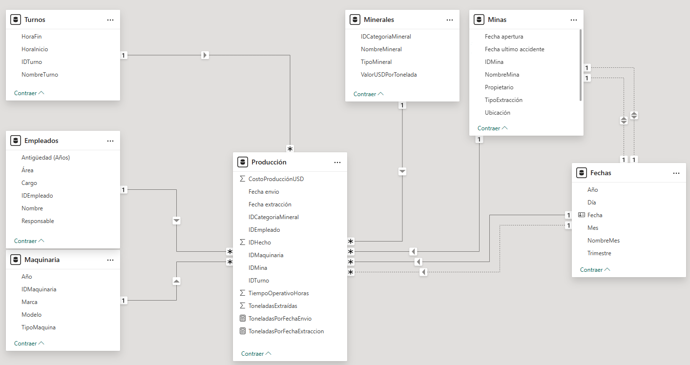
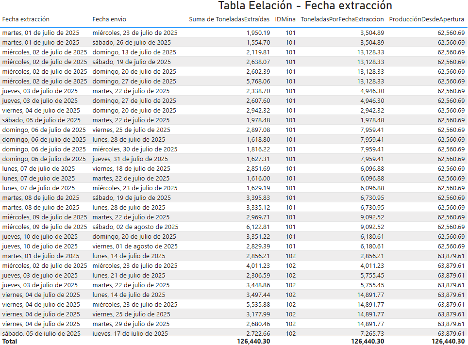
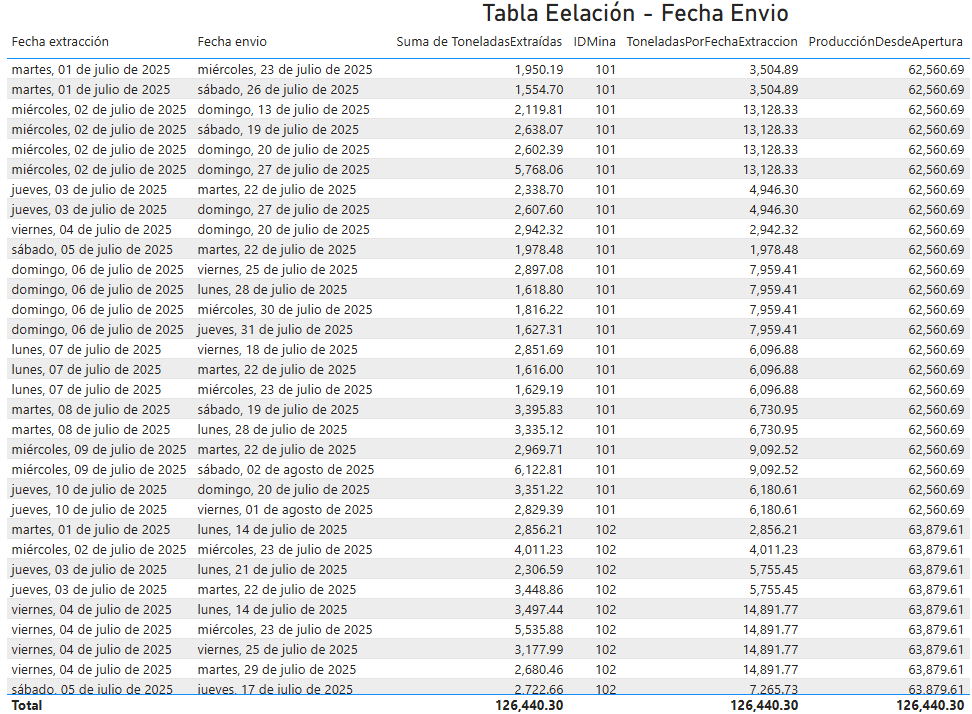

# Práctica 1. Diseño de modelo complejo a partir de múltiples fuentes con relaciones inactivas

## 📝 Planteamiento de la práctica:

Como parte de las actividades de analista de Power BI, te piden crear un modelo a partir de distintas fuentes de datos, conectándolas entre sí mediante relaciones en el modelo y creando algunas medidas que permitan analizar la información usando relaciones desactivadas.

## 🎯 Objetivos:
Al finalizar la práctica, serás capaz de:
- Crear distintas medidas en DAX para repasar las funciones financieras.

## 🕒 Duración aproximada:
- 70 minutos.

## 🔍 Objetivo visual:

---

**[Lista general 🗂️](https://netec-mx.github.io/PBI_ADV-Priv/)** | **[Siguiente ➡️](https://netec-mx.github.io/PBI_ADV-Priv/Laboratorio2.html)**

---

## Instrucciones:
### Obtener los datos

Antes de poder crear el modelo, es necesario tener acceso a los datos y, por lo tanto, poder manipularlos para que puedan ser utilizados en el análisis y el modelado.

Para ello, recordemos que la información puede provenir de distintos lugares: archivos locales, archivos remotos (ubicaciones internas de la empresa o en internet), o servicios especializados (como los de Microsoft, AWS, Google, entre muchos otros).

En ese sentido, a continuación se muestra la lista de archivos que estarás utilizando, así como su ubicación para poder acceder a ellos.

1. **Empleados.xlsx:** Se encuentra dentro de la carpeta _Documentos_ de la máquina virtual.
2. **Fechas.xlsx:** Se encuentra dentro de la carpeta _Documentos_ de la máquina virtual.
3. **Maquinaria:** Se encuentra en Google Drive. Puedes acceder al archivo mediante la siguiente liga: [Maquinaria](https://docs.google.com/spreadsheets/d/1-qGpKZzbVLMBqmVqSqjrk0n8WeymT-gg/edit?usp=sharing&ouid=107815825877798659253&rtpof=true&sd=true)
4. **Minas:** Se encuentra en una cuenta de almacenamiento de Azure. Puedes acceder al archivo mediante esta liga: [Minas.xlsx](https://view.officeapps.live.com/op/view.aspx?src=https%3A%2F%2Faccesos.blob.core.windows.net%2Frecursos%2FMinas.xlsx%3Fst%3D2025-07-14T23%3A50%3A52Z%26se%3D2025-12-31T08%3A05%3A52Z%26si%3DAccesos%2520recursos%26spr%3Dhttps%26sv%3D2024-11-04%26sr%3Db%26sig%3DVS5bQ3R4XEDILXpMcyOc2xkGO8hP8Xu9Cof2OkoFshA%253D&wdOrigin=BROWSELINK)
5. **Minerales.pdf:** Se encuentra dentro de la carpeta _Documentos_ de la máquina virtual.
6. **Producción.xlsx:** Se encuentra en una cuenta de almacenamiento de Azure. Puedes acceder al archivo mediante esta liga: [Producción.xlsx](https://view.officeapps.live.com/op/view.aspx?src=https%3A%2F%2Faccesos.blob.core.windows.net%2Frecursos%2FProducci%25C3%25B3n.xlsx%3Fst%3D2025-07-15T00%3A55%3A37Z%26se%3D2025-12-31T09%3A10%3A37Z%26si%3DAccesos%2520recursos%26spr%3Dhttps%26sv%3D2024-11-04%26sr%3Db%26sig%3DPBhZWSjYVXEtp3FkcLZvKDRfZvG80h6YORu8VzPqoqQ%253D&wdOrigin=BROWSELINK)
7. **Turnos.pdf:** Se encuentra dentro de la carpeta _Documentos_ de la máquina virtual.

  > 🔄 **Recuerda:** Es necesario realizar transformaciones para poder utilizar correctamente los datos en el modelo.

### Crear relaciones

Hasta este punto, deberías tener 7 consultas en el modelo. Debería verse, hasta el momento, algo parecido a lo siguiente:

Ahora, genera las relaciones entre las siguientes tablas:

- Empleados[IDEmpleado] → Producción[IDEmpleado]
- Maquinaria[IDMaquinaria] → Producción[IDMaquinaria]
- Minas[IDMina] → Producción[IDMina]
- Minerales[IDCategoriaMineral] → Producción[IDCategoriaMineral]
- Turnos[IDTurno] → Producción[IDTurno]

---

Ahora, genera las siguientes relaciones adicionales:

- Fechas[Fecha] → Producción[Fecha extracción]
- Fechas[Fecha] → Producción[Fecha envío]

### Crear visuales

Ahora que ya hemos generado algunas relaciones, es momento de poner a prueba los resultados usando visualizaciones de tabla como referencia.

**Paso 1.** Inserta una visualización de tabla.

**Paso 2.** Agrega los siguientes campos:
* Fecha extracción
* IDMina
* Toneladas extraidas

**Paso 3.** Asígnale el siguiente título: **Tabla Eelación - Fecha extracción**.

**Paso 4.** Copia la tabla anterior y pégala.

**Paso 5.** Modifica los campos para mostrar:
* Fecha envio
* IDMina
* Toneladas extraidas

**Paso 6.** Asígnale el título correspondiente.

### Crear medidas

Ahora que ya tenemos las tablas que contienen los datos considerando la Fecha de extracción y la Fecha de envío, lo que buscamos es crear dos medidas. Estas medidas nos permitirán ver la suma de lo extraído: una utilizando la relación predeterminada y otra utilizando la relación inactiva.

Usaremos cada métrica con la tabla que es su contraparte, es decir, la medida que utiliza la Fecha de envío se aplicará en la tabla de extracción, y la medida que utiliza la Fecha de extracción se aplicará en la tabla de envío.

> Dependiendo de cómo intentes crear la medida, puede que te devuelva los mismos resultados (si sigue recibiendo los mismos filtros), o bien una serie distinta de resultados, dependiendo de qué filtro hayas decidido mantener.

Toma como ejemplo la siguiente imagen de referencia, donde se han quitado los filtros de las fechas, resumiendo el contenido de acuerdo con el IDMina.

Ahora te piden agregar las siguientes relaciones:

- Minas [Fecha de apertura] – Fechas [Fecha]
- Minas [Fecha del último accidente] – Fechas [Fecha]

Estas dos relaciones podrían ayudarnos a hacer análisis de productividad desde la fecha de creación, o bien, análisis de seguridad desde el último accidente o antes de este.

Por ello, te piden elaborar otra medida:

- Esta medida se usará con el objetivo de calcular la cantidad de toneladas extraídas desde la fecha de creación de la mina.

---

**[Lista general 🗂️](https://netec-mx.github.io/PBI_ADV-Priv/)** | **[Siguiente ➡️](https://netec-mx.github.io/PBI_ADV-Priv/Laboratorio2.html)**

---
