# Práctica 2. Construcción de un set de medidas avanzadas para análisis financiero y productivo

## 📝 Planteamiento de la práctica:

Como parte de tus actividades como analista de Power BI, te piden crear distintas medidas con DAX para usarlas en contextos financieros. Si bien aún no te solicitan aplicarlas sobre un reporte que esté actualmente en ejecución, te comentan que necesitas comprender y tener preparados los distintos métodos de estas funciones.

## 🎯 Objetivos:
Al finalizar la práctica, serás capaz de:
- Implementar RLS y modificar expresiones DAX que no estén optimizadas.

## 🕒 Duración aproximada:
- 70 minutos.

## 🔍 Objetivo visual:

---

**[⬅️ Atrás](https://netec-mx.github.io/PBI_ADV-Priv/Laboratorio1.html)** | **[🗂️ Lista general](https://netec-mx.github.io/PBI_ADV-Priv/)** | **[Siguiente ➡️](https://netec-mx.github.io/PBI_ADV-Priv/Laboratorio3.html)**

---

### Abrir el archivo y crear 2 visualizaciones de referencia

En este punto, abre el archivo *PrimerasFunciones*, que se encuentra en la carpeta **Documentos**, dentro de la máquina virtual.

En él, crearás una visualización de tabla que contenga los detalles del préstamo. Asígnale un título como *Detalles del préstamo*.

    > IDPrestamo  
    Nombre del préstamo
    Vida (Años)
    Fecha de pago
    Tasa Anual
    Pago
    Tasa
    Número periodos
    Valor presente
    Tipo

Ahora copia y pega la tabla para tener una copia de los Detalles del préstamo. Sobre esta segunda tabla iremos mostrando los cálculos de las medidas, por lo que asígnale un título como Detalles con DAX.

> *💡 **Nota:** Puedes tomar como referencia la siguiente imagen.*

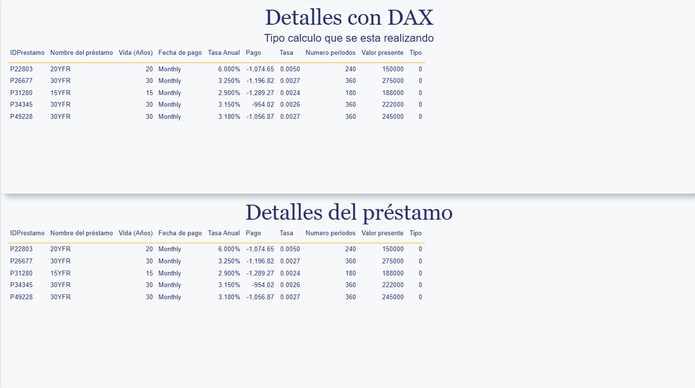

Ahora, sobre la tabla **Detalles con DAX**, asegúrate de dejar solamente los valores de las siguientes columnas:

    > IDPrestamo  
    Nombre del préstamo
    Vida (Años)
    Fecha de pago
    Tasa Anual

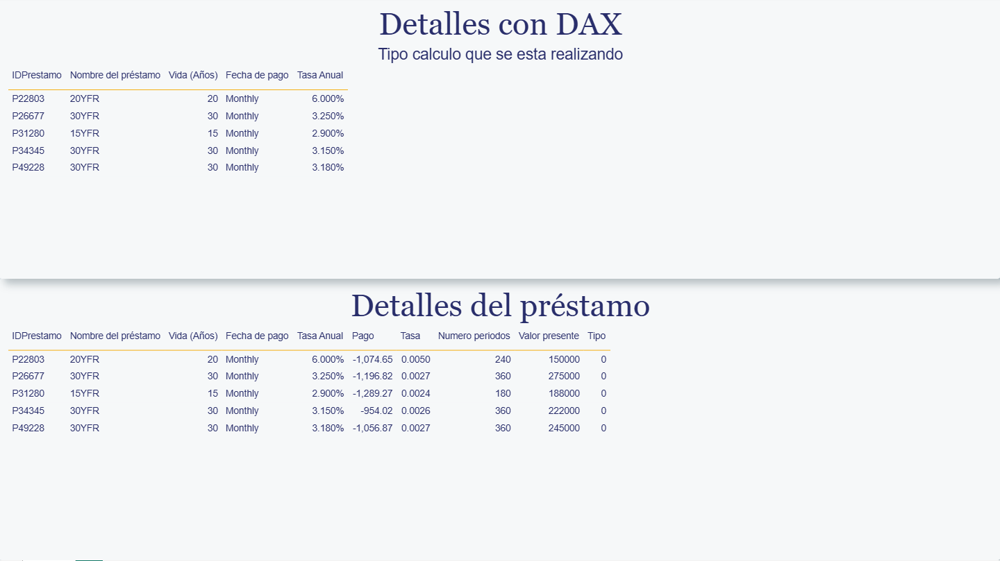

Para evitar cualquier duda con los datos que se están utilizando, se deja esta breve explicación de cada uno de los campos:

- **Tasa:** La tasa de interés por período. En este caso, mensual; es decir, se toma la tasa anual y se divide entre el número de períodos (12) para obtenerla.
- **Pago:** El pago realizado en cada período. Este pago incluye capital e intereses, pero no otras tarifas o impuestos.
- **Número de períodos:** El número total de períodos de pago.
- **Valor presente:** Cantidad total que vale una serie de pagos futuros en la actualidad.
- **Valor futuro:** Saldo de efectivo que se espera alcanzar.
- **Tipo:** Indica cuándo vencen los pagos.
    - ***0:*** Los pagos vencen al final del período.
    - ***1:*** Los pagos vencen al comienzo del período.

### Creación de los cálculos

Considerando lo anterior, te piden elaborar un cálculo que te permita obtener el monto del pago que se debe realizar. Este cálculo se denominará Pago calculado. Una vez que lo hayas creado, agrégalo a la segunda tabla.

Considera que, con los siguientes datos, puedes calcular el monto a pagar:
- Tasa de interés
- Número de períodos
- Valor presente

> *💡 **Nota:** Recuerda darle formato de **divisa** a este cálculo. Considera que, para este ejemplo, la exactitud decimal debe ser de 2 dígitos y, por último, no resumas este dato.*

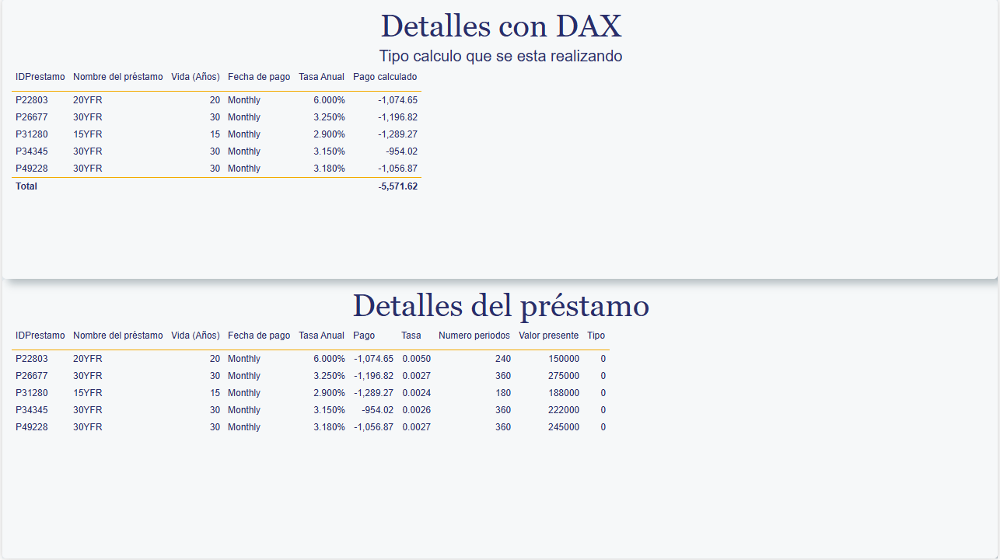

---

Ahora te piden elaborar un cálculo que te permita obtener la tasa de interés del crédito. Este cálculo se denominará **Tasa calculada**. Una vez que lo hayas obtenido, agrégalo a la segunda tabla.

Considera que, con los siguientes datos, puedes calcular la tasa: 

* Número de períodos
* Pago 
* Valor presente.
* Valor futuro
* Tipo
* Tasa anual

> *💡 **Nota:** Recuerda darle formato de **porcentaje** a este cálculo. Considera que, para este ejemplo, la exactitud decimal debe ser de 2 dígitos y, por último, no resumas este dato.*

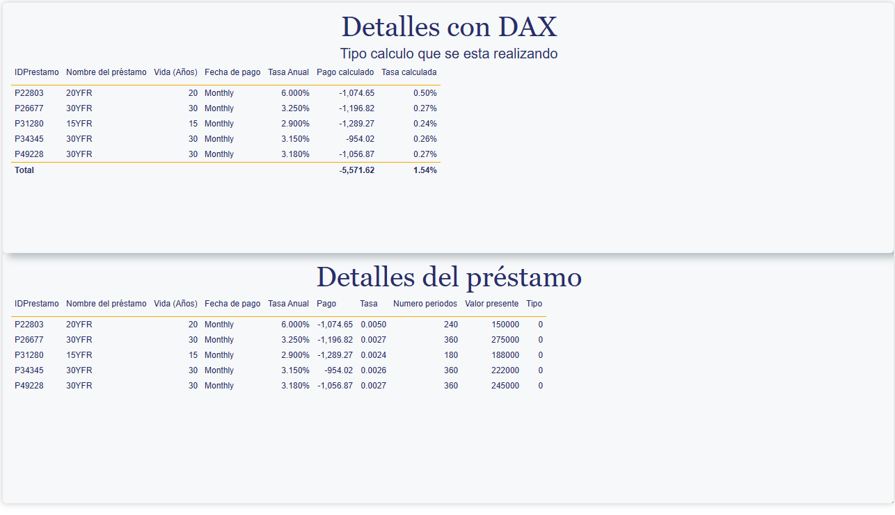

---

Ahora te piden elaborar un cálculo que te permita obtener la cantidad de períodos. Este cálculo se denominará Períodos calculados. Una vez que lo hayas obtenido, agrégalo a la segunda tabla.

Considera que, con los siguientes datos, puedes calcular la longitud de los períodos:

* Tasa anual
* Pago 
* Valor presente
* Valor futuro
* Tipo

> *💡 **Nota:** Recuerda darle formato de **número entero** a este cálculo y, por último, no resumas este dato.*

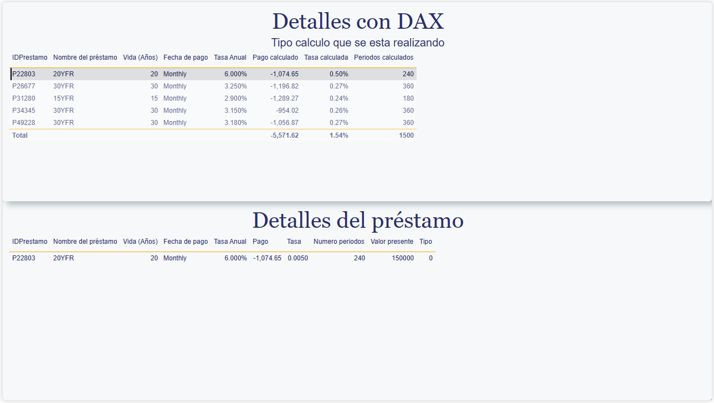

---

Ahora te piden elaborar un cálculo que te permita obtener el valor presente. Este cálculo se denominará **Valor presente calculado**. Una vez que lo hayas obtenido, agrégalo a la segunda tabla.

Considera que, con los siguientes datos, puedes calcular el valor presente:

* Tasa anual
* Número periodos
* Pago 
* Valor futuro
* Tipo

> *💡 **Nota:** Recuerda darle formato de **divisa** a este cálculo, con una precisión de dos decimales y, por último, no resumas este dato.*

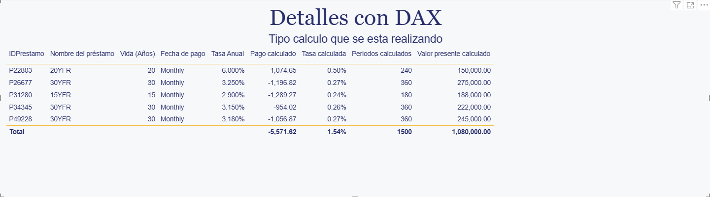

---

Ahora te piden elaborar un cálculo que te permita obtener el valor futuro. Este cálculo se denominará Valor futuro calculado. Una vez que lo hayas obtenido, agrégalo a la segunda tabla.

Considera que, con los siguientes datos, puedes calcular el valor futuro: 

* Tasa anual
* Número periodos
* Pago 
* Valor presente
* Tipo

> *💡 **Nota:** Recuerda darle formato de **divisa** a este cálculo, con una precisión de dos decimales y, por último, no resumas este dato.

---

### Abrir el segundo archivo y crear las tablas

En este punto, abre el archivo **SegundasFunciones**, que se encuentra en la carpeta **Documentos**, dentro de la máquina virtual.

En él, crearás una visualización de tabla que contenga los detalles de los activos. A esta primera tabla le pondremos el título _Depreciación en línea recta_.

- Fecha de compra
- ID Activo
- Nombre del activo
- Costo
- Valor de recuperación
- Periodo de vida  

Una vez que tengas esta tabla, cópiala y pégala tres veces, para tener un total de cuatro tablas. Posiciónalas en el lienzo de tal forma que los datos queden ordenados.

Asigna los siguientes títulos a las copias:
- Depreciación de dígitos de suma de años
- Depreciación de saldo decreciente fija
- Depreciación de saldo decreciente doble

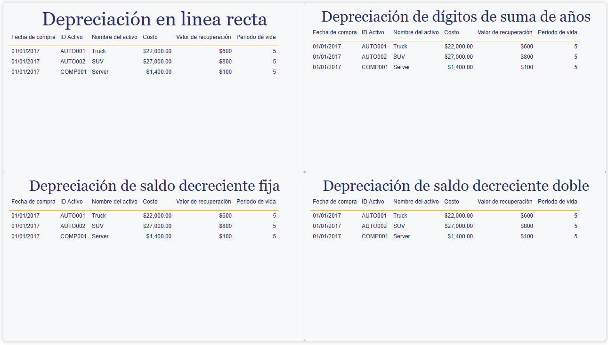

---

Sin entrar en detalle sobre las implicaciones y formas de depreciación que se pueden llevar a cabo, ni sobre el marco legal aplicable en cada país, podemos observar que, indistintamente de estos aspectos, los parámetros utilizados son muy similares para estas operaciones.

Los argumentos o parámetros compartidos son:
- Costo: el costo inicial del activo.
- Valor de salvamento: el valor al final de la depreciación.
- Período de vida: el número de períodos durante los cuales se deprecia el activo.

---

Ahora te piden elaborar un cálculo que te permita obtener la depreciación de un activo, donde el monto por depreciar sea el mismo durante todos los períodos. Este valor se denominará Depreciación línea recta. Una vez que lo hayas obtenido, agrégalo a la segunda tabla.

Considera que, con los siguientes datos, puedes calcular la depreciación:

- Costo
- Valor de recuperación
- Período de vida

> *💡 **Nota:** Recuerda darle formato de **divisa** a este cálculo, con una precisión de dos decimales y, por último, no resumas este dato.*

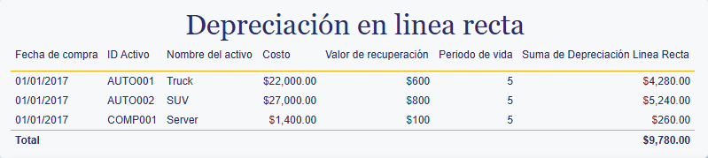

---

Ahora te piden elaborar un cálculo que te permita obtener la depreciación de un activo, donde el monto por depreciar sea inicialmente más elevado y, posteriormente, más bajo. Este valor se denominará DepreciaciónSA17 y representará el valor a depreciar en el primer año. Una vez que lo hayas obtenido, agrégalo a la segunda tabla.

Considera que, con los siguientes datos, puedes calcular la depreciación:

* Costo
* Valor de recuperacion
* Período de vida
* Tiempo de depreciación

> *💡 **Nota:** Recuerda darle formato de **divisa** a este cálculo, con una precisión de dos decimales y, por último, no resumas este dato.*

Haz lo mismo ahora para los años 2018, 2019, 2020 y 2021.

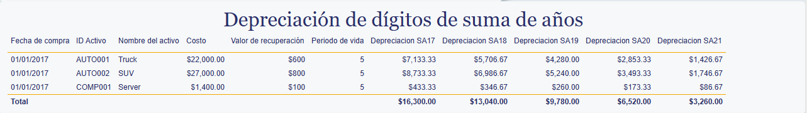

---

Ahora te piden elaborar un cálculo que te permita obtener la depreciación de un activo, donde el monto por depreciar sea inicialmente más elevado y, posteriormente, más bajo. Este valor se denominará DepreciaciónSF17 y representará el valor a depreciar en el primer año. Una vez que lo hayas obtenido, agrégalo a la segunda tabla.

Considera que, con los siguientes datos, puedes calcular la depreciación:

* Costo
* Valor de recuperacion
* Período
* Número de meses para el primer año

> *💡 **Nota:** Recuerda darle formato de **divisa** a este cálculo, con una precisión de dos decimales y, por último, no resumas este dato.*

Haz lo mismo ahora para los años 2018, 2019, 2020 y 2021.

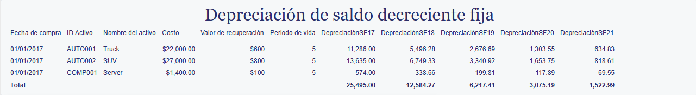

---

Ahora te piden elaborar un cálculo que te permita obtener la depreciación de un activo usando el método de saldo decreciente doble. Este valor se denominará DepreciaciónDD17 y representará el valor a depreciar en el primer año. Una vez que lo hayas obtenido, agrégalo a la segunda tabla.

Considera que, con los siguientes datos, puedes calcular la depreciación:

* Costo
* Valor de recuperación
* Período de vida
* Período

> *💡 **Nota:** Recuerda darle formato de **divisa** a este cálculo, con una precisión de dos decimales y, por último, no resumas este dato.*

Haz lo mismo ahora para los años 2018, 2019, 2020 y 2021.

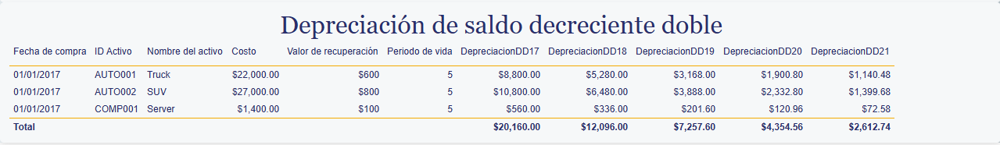

---

**[⬅️ Atrás](https://netec-mx.github.io/PBI_ADV-Priv/Laboratorio1.html)** | **[🗂️ Lista general](https://netec-mx.github.io/PBI_ADV-Priv/)** | **[Siguiente ➡️](https://netec-mx.github.io/PBI_ADV-Priv/Laboratorio3.html)**

---
