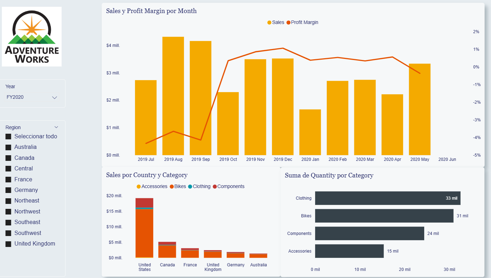
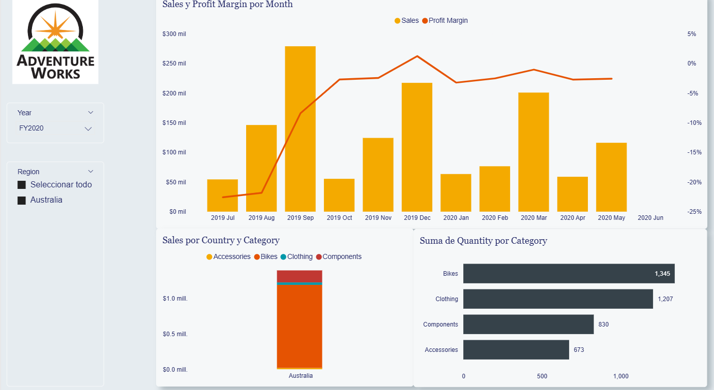
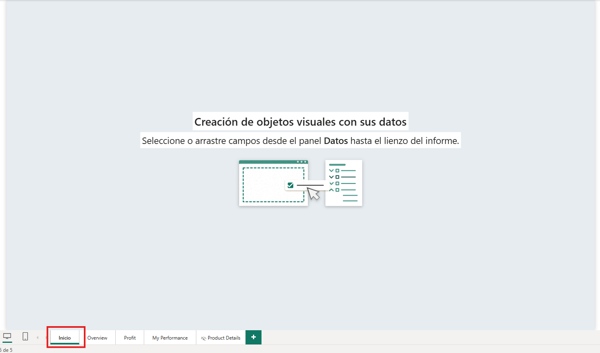
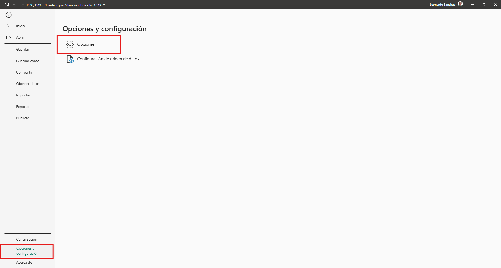
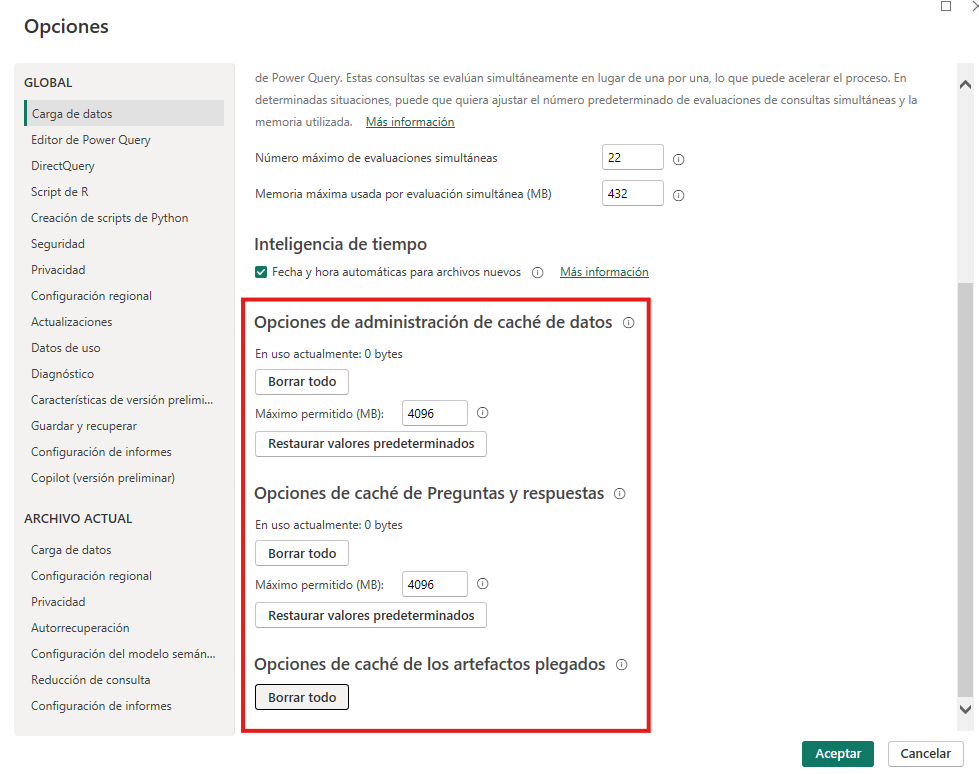
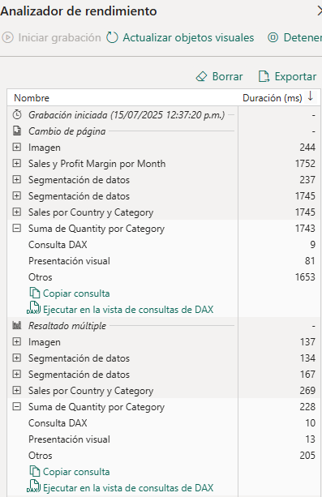
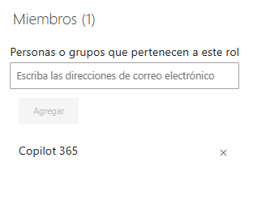
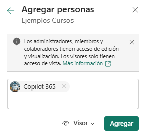

# Práctica 3. Aplicar RLS sobre un modelo y optimizar consultas lentas con análisis de rendimiento

## 📝 Planteamiento de la práctica:
Como parte de las actividades de analista de Power BI, te piden crear roles dentro de un modelo para impedir que la información sea visible para todos en la organización, y que de esta manera podamos tener un control más granular sobre la información.

Además de ello, te solicitan revisar el desempeño general de un informe, con el objetivo de identificar posibles cuellos de botella o consultas que puedan ser optimizadas.

## 🎯 Objetivos:
Al finalizar la práctica, serás capaz de:
- Implementar RLS y modificar expresiones DAX que no estén optimizadas.

## 🕒 Duración aproximada:
- 70 minutos.

## 🔍 Objetivo visual:

---

**[⬅️ Atrás](https://netec-mx.github.io/PBI_ADV-Priv/Laboratorio2.html)** | **[🗂️ Lista general](https://netec-mx.github.io/PBI_ADV-Priv/)** | **[Siguiente ➡️](https://netec-mx.github.io/PBI_ADV-Priv/Laboratorio4.html)**

---

## Instrucciones:

### Tarea 1. Explorar los datos.

**Paso 1.** Comienza abriendo el archivo denominado "RLS y DAX", que se encuentra dentro de la máquina virtual, en la carpeta Documentos.

**Paso 2.** Una vez accedas al archivo, explora su contenido: navega por él y revisa la información disponible.

**Paso 3.** A partir de tus observaciones, te piden aplicar, en primer lugar, una serie de roles para que, dependiendo de la persona a la que se le otorgue dicho rol, solo pueda ver la información de un grupo determinado. Fuera de eso, no debería poder visualizar información de los otros grupos.

## Tarea 2. Crear roles.

**Paso 1.** Con esto en mente, te piden crear tres roles para representar a cada uno de los siguientes grupos:

* América
* Europa
* Pacífico

**Paso 2.** Prueba cada uno de estos roles y observa qué información queda disponible con cada uno de ellos.

> *💡 **Nota:** Puedes guiarte con la siguiente imagen como referencia.*

Si bien esta primera aproximación resulta útil para filtrar el contenido según el grupo al que le vende uno de los vendedores, te das cuenta de que los vendedores suelen vender a más de un territorio. Por lo tanto, seguir implementando este enfoque "estático" quizás no sea lo más conveniente.

**Paso 3.** Por ello, te piden crear un nuevo rol. Este nuevo rol debe filtrar de forma dinámica con base en el correo electrónico del usuario, de modo que solo vea la información relacionada con él.

Este rol, por el momento, solo filtrará la información de las tablas **Salesperson** y **Salesperson Performance**.

**Paso 4.** Vuelve a revisar el contenido del reporte y observa que ahora la información se muestra únicamente cuando el correo del usuario coincide con el del usuario que ha iniciado sesión.

Este tipo de filtrado dinámico lo puedes utilizar para aplicar filtros en otras tablas y controlar el contenido de manera más flexible.

Dependiendo de las expresiones DAX que utilices, podrás filtrar la información de formas más complejas que las que se te solicitaron anteriormente.

Por ejemplo, en lugar de obtener el UPN, podrías hacer búsquedas con los valores que ya existen en tus tablas (como el ID de los empleados). Así, podrás construir expresiones personalizadas para cumplir con distintas necesidades de filtrado.

### Tarea 3. Explorar el rendimiento.

Dejando de lado lo anterior, ahora te piden examinar el desempeño del reporte, por lo que es necesario comenzar a registrar los tiempos de respuesta dentro de las páginas del informe, con el fin de detectar posibles cuellos de botella.

Para obtener una medición precisa:

**Paso 1.** Genera una nueva página en blanco y ubícala como la primera página del reporte.

**Paso 2.** Luego, ve a los ajustes de Power BI.

**Paso 3.** Borra todos los datos en caché que Power BI tenga almacenados actualmente.

**Paso 4.** Ahora guarda los cambios que realizaste y procede a cerrar Power BI Desktop. Esto tiene como objetivo que, al volver a abrir el reporte, los tiempos de carga sean lo más limpios posibles y no se utilice contenido almacenado en caché.

**Paso 5.** Una vez que vuelvas a abrir Power BI Desktop, habilita el Analizador de rendimiento, navega entre las distintas páginas del reporte y observa los resultados que se van generando.

> *💡 **Nota:** En la imagen se muestran los datos de referencia obtenidos durante el primer análisis en la página Overview. Ten en cuenta que los datos pueden variar respecto a los que tú obtengas.*

Después de interactuar y observar los resultados, no deberías tener ningún caso en el que los tiempos de respuesta de DAX sean demasiado elevados.

Recuerda que tiempos de respuesta de DAX mayores a 200 ms son indicadores de elementos que potencialmente deberían ser optimizados.

Si bien, en nuestra exploración con el conjunto de datos, no parecen existir resultados críticos que deban cambiarse o corregirse, esto no significa que las fórmulas utilizadas para calcular las medidas o columnas sean necesariamente las más correctas o eficientes.

**Paso 6.** Por ello, dirígete a la vista del modelo y explora las distintas medidas que se encuentran disponibles.

* Avg Price
* Max Price
* Median Price
* Min Price
* Order Lines
* Orders
* Profit
* Profit Margin
* Sales % All Region
* Sales % Country
* Sales % Group
* Sales YoY Growth
* Sales YTD
* Target
* Variance
* Variance Margin

**Paso 7.** Después de observar los datos, deberías realizar algunos cambios en al menos cuatro medidas.

Estos cambios estarán enfocados principalmente en el uso de variables, con el fin de optimizar ligeramente las consultas.

**Paso 8.** Una vez aplicadas las modificaciones, prueba nuevamente el desempeño del informe para examinar qué tanto impacto tuvieron los cambios en el rendimiento general.

### Tarea 4. Publicación en Power BI.

**Paso 1.** Una vez que tengas estos resultados listos y estés conforme con ellos, procederás a publicar el reporte en el servicio de Power BI.

**Paso 2.** Para ello, será necesario iniciar sesión en Power BI Desktop con la cuenta designada por tu instructor, a fin de poder acceder al entorno correspondiente.

Es momento de iniciar sesión en Power BI Service, para lo cual puedes usar la siguiente liga:

👉 [https://app.powerbi.com/](https://app.powerbi.com/)

**Paso 3.** Dentro del servicio de Power BI, genera un área de trabajo. Esta área de trabajo se denominará **EjercicioRLSXXXX**, donde cada X representa tus iniciales.

Dentro de esta área de trabajo será donde subirás tu contenido.

**Paso 4.** Una vez que hayas creado el área de trabajo, procede a subir el contenido al servicio de Power BI.

**Paso 5.** Luego, nuevamente en el servicio de Power BI, configura la seguridad del modelo para poder asignar uno de los roles que acabas de crear a un usuario.

> *💡 **Nota:** En la siguiente imagen se muestra un ejemplo de un usuario asignado a uno de los roles. A partir de asignarle este rol, ese usuario podrá ver únicamente la información limitada correspondiente, siempre y cuando haya sido invitado como lector.*

**Paso 6.** Ahora que el rol está asignado a un usuario, procede a invitar a dicho usuario como miembro lector del área de trabajo.

A partir de este momento, el usuario debería ser capaz de ver la información de forma "controlada", de acuerdo con el rol que le hayas asignado.

---

**[⬅️ Atrás](https://netec-mx.github.io/PBI_ADV-Priv/Laboratorio2.html)** | **[🗂️ Lista general](https://netec-mx.github.io/PBI_ADV-Priv/)** | **[Siguiente ➡️](https://netec-mx.github.io/PBI_ADV-Priv/Laboratorio4.html)**

---
