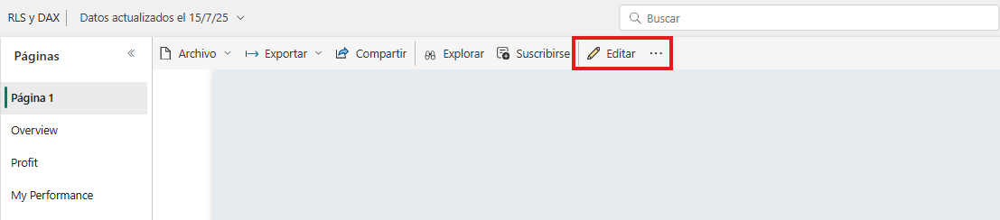
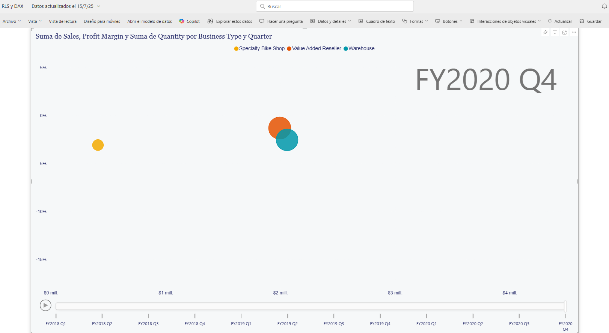
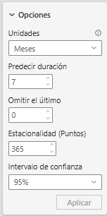
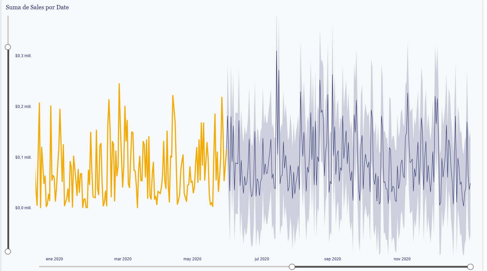

# Práctica 4. Dashboard inteligente con segmentación automática de clientes y predicción de ingresos futuros

## 📝 Planteamiento de la práctica:

Como parte de las actividades de analista de Power BI, te piden crear un panel que te permita ver la información más relevante y, a partir de esta, poder tomar decisiones.

Esta información no siempre está disponible y, en ocasiones, justamente buscamos predecir estos valores antes de tenerlos. Por ello, a partir del informe que elaboraste anteriormente en el ejercicio previo, lo modificaremos para agregar dos páginas nuevas, y estas páginas las asignaremos a un panel.

## 🎯 Objetivos:
Al finalizar la práctica, serás capaz de:
- Crear un dashboard con análisis predictivo.

## 🕒 Duración aproximada:
- 70 minutos.

## 🔍 Objetivo visual:

---

**[⬅️ Atrás](https://netec-mx.github.io/PBI_ADV-Priv/Laboratorio3.html)** | **[🗂️ Lista general](https://netec-mx.github.io/PBI_ADV-Priv/)**

---
## Instrucciones:
### Tarea 1. Modificar el reporte.

**Paso 1.** Ingresa al servicio de Power BI. Una vez dentro, ve al informe que subiste en el ejercicio pasado y selecciona el ícono de edición para proceder a modificarlo.

**Paso 2.** Genera una nueva página y asígnale el nombre **Dispersión**. En ella, inserta un gráfico de dispersión que abarque toda la página.

Este visual debe contener los siguientes datos:

- Eje X: Sales | Sales
- Eje Y: Sales | Profit Margin
- Leyenda: Reseller | Business Type
- Tamaño: Sales | Quantity
- Eje de reproducción: Date | Quarter

**Paso 3.** Agrega a los filtros de la página la categoría Product | Category y selecciona, por ejemplo, Bikes.

Comienza con la animación y observa cómo la información se va actualizando con el pasar del tiempo.

**Paso 4.** Al finalizar la animación, selecciona cualquiera de las burbujas para ver la información en detalle y el recorrido que realiza a lo largo del tiempo.

**Paso 5.** Cambia el valor del filtro a otro tipo de producto y observa los resultados.

**Paso 6.** Genera una nueva página y asígnale el nombre **Predicción**. En ella, inserta un gráfico de líneas que abarque toda la página.

Este visual debe contener los siguientes datos:

* Eje X: Date | Date
* Eje Y: Sales | Sales

**Paso 7.** Agrega a los filtros de la página la categoría Date | Year y selecciona los años fiscales 2019 y 2020.

**Paso 8.** Agrega un control deslizante para poder ver más o menos información, dependiendo de lo que desees analizar.

**Paso 9.** Agrega la opción de Previsión y configúrala de la siguiente forma:

- Calcula los meses siguientes hasta llegar a finales de 2020.
- Considera los datos de todo un año.
- Establece el rango de confianza en un 80%.

El resultado final debe verse similar a lo siguiente:

### Tarea 2. Crear un panel y asignarle el contenido.

**Paso 1.** A partir de lo anterior, ahora solo falta agregar el contenido a un dashboard. Para ello, ancla las hojas del reporte en un nuevo panel, con el fin de mantener los elementos interactivos dentro de él.

> *💡 **Nota:** Recuerda que, dependiendo del contenido que fijes en un panel, ese elemento puede perder su interactividad. Si deseas mantener los elementos tal como están (incluyendo sus interacciones), fija siempre la hoja completa en lugar de la visualización individual.*

**Paso 2.** Una vez hayas fijado el contenido en el panel, ingresa en él y verifica que se haya mostrado correctamente.
